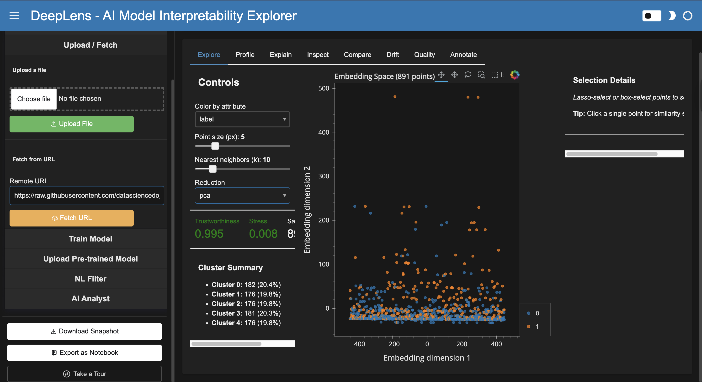
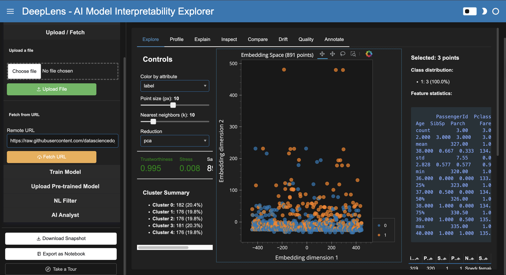
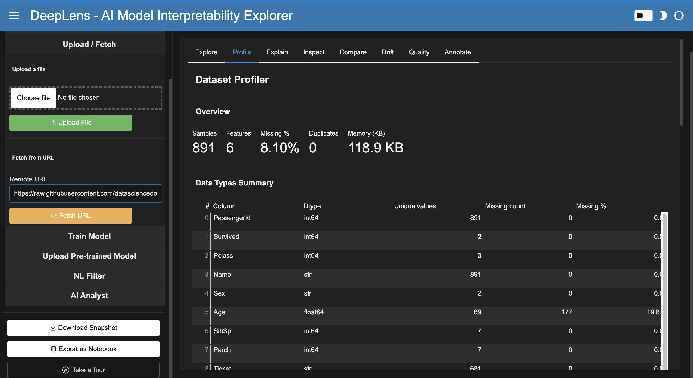
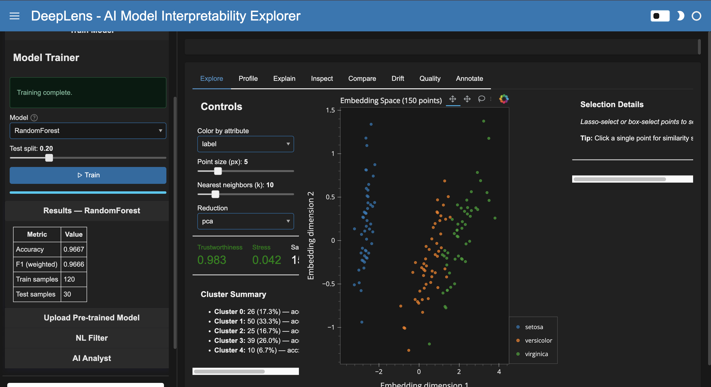
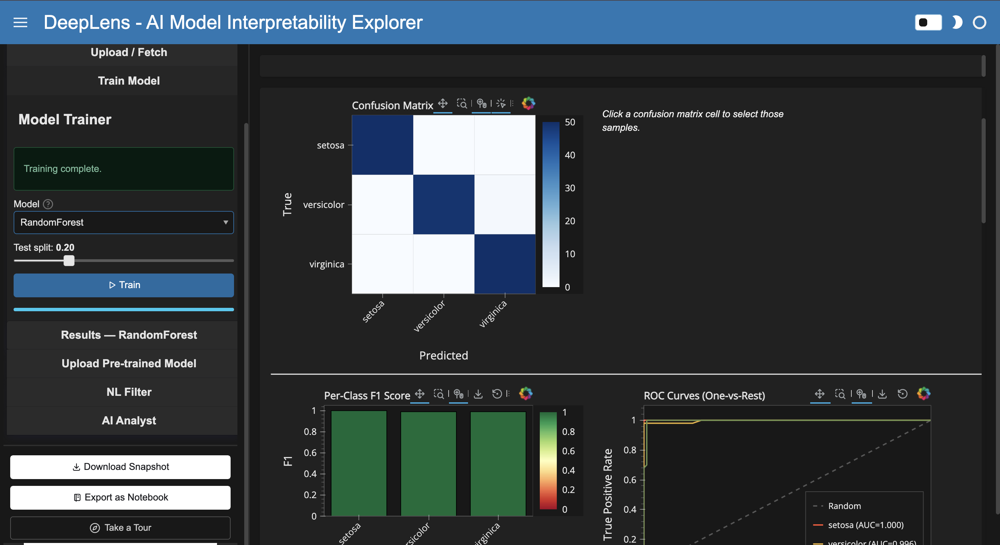
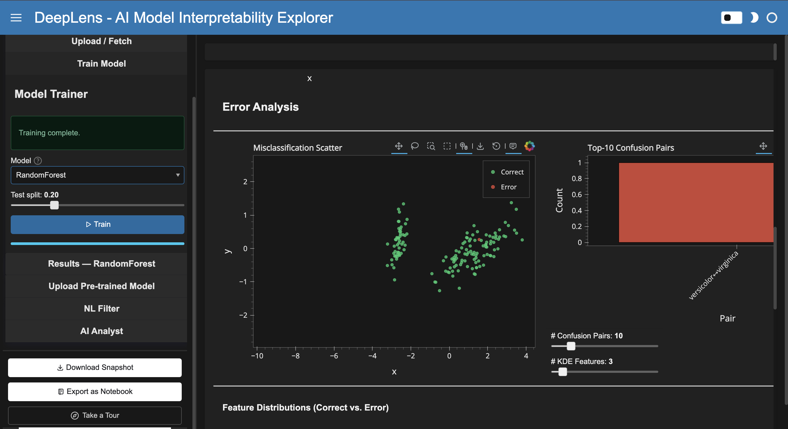
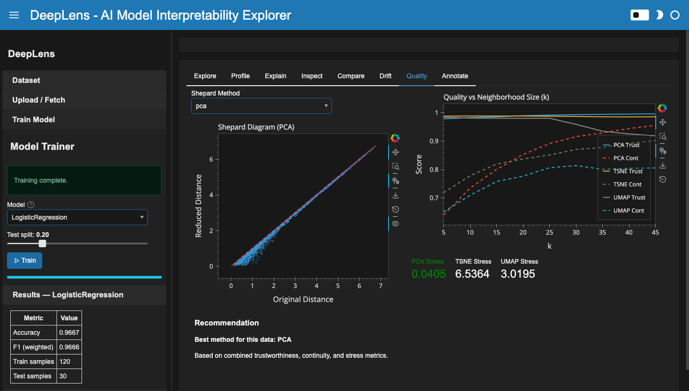
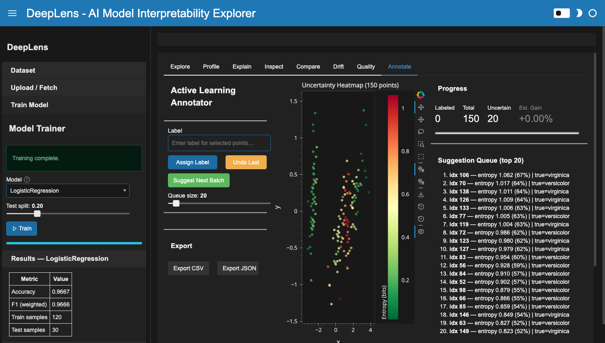

<h1 align="center">DeepLens</h1>

<p align="center">
  <strong>Interactive AI Model Interpretability & Embedding Explorer</strong>
</p>

<p align="center">
  
  
  
  
  
</p>

<p align="center">
  Powered by the <a href="https://holoviz.org/">HoloViz</a> ecosystem — combines embedding visualization, SHAP attribution, counterfactual exploration, data drift detection, multi-model comparison, dataset profiling, error analysis, and LLM-powered insights in a single cross-filtered dashboard.
</p>

<p align="center">

```python
import deeplens
deeplens.explore("iris")
```

</p>

---

## The Problem

Understanding ML models requires jumping between 5+ disconnected tools: TensorBoard for embeddings, SHAP for explanations, custom scripts for drift detection, notebooks for data profiling, and spreadsheets for annotation. None of these tools cross-filter, so you lose context at every step.

**DeepLens** puts everything in one dashboard where selecting points in the embedding space instantly updates SHAP explanations, error analysis, counterfactuals, and annotation queues.

| Feature | TensorBoard | Arize Phoenix | W&B | What-If Tool | **DeepLens** |
|---------|:-----------:|:-------------:|:---:|:------------:|:------------:|
| Interactive embedding viz | Partial | Yes | No | No | **Yes (Datashader)** |
| SHAP integration | No | No | Limited | No | **Yes (Interactive)** |
| Counterfactual explorer | No | No | No | Static | **Yes (Drag-to-explore)** |
| Dataset profiling | No | Partial | No | No | **Yes (Auto)** |
| Data drift detection | No | Static | No | No | **Yes (KS + PSI)** |
| Multi-model comparison | No | No | Yes | No | **Yes (Agreement zones)** |
| DR quality assessment | No | No | No | No | **Yes (Shepard + metrics)** |
| Active learning annotation | No | No | No | No | **Yes (Lasso + label)** |
| Error analysis deep dive | No | No | No | No | **Yes (Hardest samples)** |
| NL data filtering | No | No | No | No | **Yes (LLM + filter)** |
| Notebook export | No | No | Yes | No | **Yes (1-click .ipynb)** |
| Cross-filtered everything | No | No | No | No | **Yes** |

---

## Built With

<p align="center">
  <a href="https://panel.holoviz.org/"></a>&nbsp;&nbsp;
  <a href="https://holoviews.org/"></a>&nbsp;&nbsp;
  <a href="https://datashader.org/"></a>&nbsp;&nbsp;
  <a href="https://hvplot.holoviz.org/"></a>&nbsp;&nbsp;
  <a href="https://bokeh.org/"></a>&nbsp;&nbsp;
  <a href="https://param.holoviz.org/"></a>&nbsp;&nbsp;
  <a href="https://scikit-learn.org/"></a>&nbsp;&nbsp;
  <a href="https://shap.readthedocs.io/"></a>&nbsp;&nbsp;
  <a href="https://numpy.org/"></a>&nbsp;&nbsp;
  <a href="https://pandas.pydata.org/"></a>&nbsp;&nbsp;
  <a href="https://umap-learn.readthedocs.io/"></a>
</p>

---

## Interactive Dashboard

The dashboard features **8 tabs** with lazy-loaded modules, a collapsible sidebar with dataset selection, model training, NL filtering, and AI analyst chat. All views are cross-filtered through a shared reactive state.

### Embedding Explorer

> Titanic dataset (891 samples) — fetched from remote URL, PCA-reduced with auto-clustering, trustworthiness 0.995



### Lasso Selection & Details

> Select points with lasso or box-select to see class distribution, feature statistics, and sample table

<table>
<tr>
<td></td>
<td></td>
</tr>
<tr>
<td align="center"><em>Full embedding scatter with cluster summary</em></td>
<td align="center"><em>Lasso selection → class distribution + feature stats</em></td>
</tr>
</table>

### Model Training & Iris Explorer

> Train RandomForest on Iris — 96.67% accuracy, per-class coloring with setosa/versicolor/virginica legend



### Model Inspector

> Confusion matrix (clickable cells), per-class F1 scores, ROC curves with AUC



### Error Analysis & Drift Detection

<table>
<tr>
<td></td>
<td></td>
</tr>
<tr>
<td align="center"><em>Misclassification scatter, top confused pairs, feature distributions</em></td>
<td align="center"><em>KS statistic bars, PSI scores, reference vs production overlays</em></td>
</tr>
</table>

### DR Quality & Active Learning

<table>
<tr>
<td></td>
<td></td>
</tr>
<tr>
<td align="center"><em>Shepard diagram, trustworthiness/continuity curves, method recommendation</em></td>
<td align="center"><em>Uncertainty heatmap, suggestion queue, label + export</em></td>
</tr>
</table>

### Dashboard Tabs

- **Explore**: Datashader scatter, lasso select, k-NN similarity search, auto-clustering, DR quality indicators
- **Profile**: Overview stats, data types, missing values heatmap, correlations, class balance, feature distributions, outlier summary
- **Explain**: SHAP waterfall/importance/distribution + counterfactual explorer with feature sliders
- **Inspect**: Confusion matrix, ROC curves, per-class F1 + Error Analysis (misclassification scatter, confused pairs, hardest samples)
- **Compare**: Side-by-side model comparison with agreement zones (train 2+ models)
- **Drift**: KS statistic bars, PSI scores, reference vs production distribution overlays
- **Quality**: Shepard diagram, trustworthiness/continuity curves, stress comparison, auto-recommendation
- **Annotate**: Entropy-based uncertainty heatmap, suggestion queue, lasso + label + undo, CSV/JSON export

---

## Features

| Category | Feature |
|----------|---------|
| **Embeddings** | TF-IDF, sentence-transformers, CLIP; PCA/t-SNE/UMAP reduction with live tuning |
| **Exploration** | Datashader scatter (100K+ points), lasso select, k-NN similarity, auto-clustering |
| **Profiling** | Missing values heatmap, correlations, class balance, distributions, IQR outliers |
| **SHAP** | Interactive waterfall, beeswarm, dependence, feature importance (HoloViews) |
| **Counterfactual** | Feature sliders, real-time prediction, minimum-change finder |
| **Inspection** | Confusion matrix (clickable), ROC curves, per-class F1, decision boundary |
| **Error Analysis** | Misclassification scatter, confused pairs, correct vs error distributions, hardest samples |
| **Comparison** | Agreement zones, complementarity score, side-by-side metrics |
| **Drift** | KS test, PSI, per-feature distribution overlay, temporal analysis |
| **DR Quality** | Shepard diagram, trustworthiness/continuity curves, stress, auto-recommendation |
| **Annotation** | Uncertainty sampling, lasso + label + undo, progress tracking, CSV/JSON export |
| **LLM** | NL filter (query → pandas), AI analyst chat, cluster storytelling, Gemini/Groq/Ollama |

### Sidebar Controls

- **5 built-in datasets**: Iris, Wine, Digits, Breast Cancer, 20 Newsgroups
- **File upload**: CSV, TSV, JSON, JSONL, Parquet, Excel
- **Remote URL fetch**: Load datasets from any URL
- **5 sklearn classifiers**: LogisticRegression, RandomForest, SVM, GradientBoosting, KNN
- **Pre-trained model upload**: `.pkl` / `.joblib` files
- **NL Filter**: Natural language queries converted to pandas expressions
- **AI Analyst**: Floating chat panel with LLM insights
- **Export**: Download snapshot (JSON), export as Jupyter notebook (1-click)
- **Guided Tour**: Interactive walkthrough for new users

---

## Quick Start

### One-liner

```python
import deeplens
deeplens.explore("iris")
```

### With your own data

```python
import pandas as pd
import deeplens

df = pd.read_csv("my_data.csv")
deeplens.explore(df, text_col="review", label_col="sentiment")
```

### Full dashboard

```python
deeplens.dashboard(dataset="iris")
```

### Compare two models

```python
from sklearn.linear_model import LogisticRegression
from sklearn.ensemble import RandomForestClassifier

model_a = LogisticRegression().fit(X_train, y_train)
model_b = RandomForestClassifier().fit(X_train, y_train)

deeplens.compare(model_a, model_b, X_test, y_test)
```

### Detect data drift

```python
deeplens.drift(train_df, prod_df, timestamp_col="date")
```

### CLI

```bash
python -m deeplens --dataset iris
python -m deeplens --dataset wine --llm gemini --port 5006
```

### Run the Dashboard

```bash
# Built-in dataset
python -m deeplens --dataset iris

# With LLM-powered AI Analyst
GOOGLE_API_KEY="your-key" python -m deeplens --dataset iris --llm gemini

# Custom port, no browser auto-open
python -m deeplens --dataset wine --port 5006 --no-browser
```

---

## Individual Components

Every module works standalone in a Jupyter notebook:

```python
from deeplens.embeddings.explorer import EmbeddingExplorer
from deeplens.explain.engine import ExplainabilityEngine
from deeplens.explain.counterfactual import CounterfactualExplorer
from deeplens.compare.models import ModelArena
from deeplens.compare.drift import DriftDetector
from deeplens.quality.dr_quality import DRQualityDashboard
from deeplens.annotate.labeler import ActiveLearningAnnotator
from deeplens.data.profiler import DatasetProfiler
from deeplens.models.error_analysis import ErrorAnalyzer
from deeplens.export.notebook import NotebookExporter

# Any component can be displayed standalone
explorer = EmbeddingExplorer(state=my_state)
explorer.servable()
```

---

## Architecture

```
User Data (CSV, Parquet, sklearn, URL, file upload)
    |
    v
DeepLensState (param.Parameterized) - single reactive state object
    |
    +---> EmbeddingComputer (TF-IDF / sentence-transformers / features)
    |         |
    |         v
    |     DimensionalityReducer (PCA / t-SNE / UMAP)
    |         |
    |         v
    |     embeddings_2d --> all visualization modules
    |
    +---> ModelTrainer (async via ThreadPoolExecutor)
    |         |
    |         v
    |     trained_model + predictions + probabilities
    |         |
    |         v
    |     Inspector, ErrorAnalyzer, SHAP, Counterfactual, Annotator
    |
    +---> state.selected_indices (cross-filter propagation)
              |
              v
        All views update reactively via param.depends()
```

---

## Test Suite

```
$ pytest tests/ -v
======================= 1200+ passed, 5 skipped in ~80s ========================
```

| Module | Tests | Covers |
|--------|-------|--------|
| `test_dashboard.py` | 80+ | Dashboard creation, tab building, ingestion, sidebar, layout |
| `test_profiler.py` | 57 | Dataset profiling: overview, missing, correlations, outliers, class balance |
| `test_llm.py` | 56 | LLM providers (Gemini/Groq/Ollama), CompositeLLM, sanitize_expression |
| `test_embeddings.py` | 40+ | TF-IDF, feature embeddings, NaN handling, sparse matrix, dispatch |
| `test_shap_plots.py` | 55 | Waterfall, beeswarm, dependence, importance, real model integration |
| `test_counterfactual.py` | 57 | Binary search, slider logic, feature perturbation, panel interface |
| `test_error_analysis.py` | 43 | Misclassification, confusion pairs, hardest samples, cluster errors |
| `test_inspector.py` | 42 | Confusion matrix, ROC, metrics, per-class F1, decision boundary |
| `test_explorer.py` | 38 | Embedding scatter, selection, similarity, clustering, datashader |
| `test_quality.py` | 48 | Shepard diagram, stress, trustworthiness, continuity, recommendation |
| `test_compare_models.py` | 33 | Model arena, agreement zones, complementarity, binary support |
| `test_notebook_export.py` | 42 | Jupyter notebook generation, conditional cells, save/load |
| `test_drift.py` | 24 | PSI, KS test, caching, panel rendering |
| `test_sources.py` | 52 | SklearnSource, EmbeddingSource |
| `test_transforms.py` | 48 | NormalizeTransform, EmbeddingTransform, DRTransform, SHAP |
| Other modules | 100+ | Config, chat, init, main, loaders, trainer, NL filter, labeler |

---

## Installation

```bash
git clone https://github.com/ghostiee-11/deeplens.git
cd deeplens
pip install -e ".[all,dev]"
```

### Dependency Tiers

| Install | What you get |
|---------|-------------|
| `pip install deeplens` | Core: Panel, HoloViews, Datashader, sklearn, embedding explorer |
| `pip install deeplens[explain]` | + SHAP waterfall/beeswarm/counterfactual |
| `pip install deeplens[embeddings]` | + sentence-transformers, UMAP |
| `pip install deeplens[images]` | + CLIP embeddings for image datasets |
| `pip install deeplens[llm]` | + Gemini Flash for AI analyst |
| `pip install deeplens[all]` | Everything |

---

## LLM Configuration

DeepLens supports multiple LLM providers for the AI Analyst and NL Filter:

```bash
# Gemini (default, free tier)
export GOOGLE_API_KEY="your-key"
python -m deeplens --dataset iris --llm gemini

# Groq (free tier)
export GROQ_API_KEY="your-key"
python -m deeplens --dataset iris --llm groq

# Ollama (local, free)
ollama pull llama3.2
python -m deeplens --dataset iris --llm ollama
```

---

## Project Structure

```
deeplens/
├── deeplens/
│   ├── __init__.py          # Public API: explore(), compare(), drift(), dashboard()
│   ├── __main__.py          # CLI: python -m deeplens
│   ├── config.py            # DeepLensState - central reactive state
│   ├── data/
│   │   ├── loaders.py       # Dataset loading (sklearn, CSV, URL, HuggingFace)
│   │   ├── sources.py       # Custom Lumen Sources
│   │   ├── transforms.py    # Custom Lumen Transforms
│   │   └── profiler.py      # Automatic dataset profiling
│   ├── embeddings/
│   │   ├── compute.py       # Embedding computation (TF-IDF, sentence-transformers, CLIP)
│   │   ├── reduce.py        # Dimensionality reduction with quality metrics
│   │   └── explorer.py      # Datashader scatter + lasso + similarity search
│   ├── explain/
│   │   ├── shap_plots.py    # Interactive SHAP plots as HoloViews elements
│   │   ├── engine.py        # SHAP - embeddings cross-filtering engine
│   │   └── counterfactual.py# Drag-to-explore counterfactual UI
│   ├── models/
│   │   ├── trainer.py       # Model training with async support
│   │   ├── inspector.py     # Confusion matrix, ROC, metrics dashboard
│   │   └── error_analysis.py# Error analysis deep dive
│   ├── compare/
│   │   ├── models.py        # Multi-model comparison arena
│   │   └── drift.py         # Data drift detector (KS + PSI)
│   ├── analyst/
│   │   ├── llm.py           # LLM abstraction (Gemini / Groq / Ollama)
│   │   ├── chat.py          # ChatInterface + cluster storyteller
│   │   └── nl_filter.py     # Natural language → pandas query
│   ├── annotate/
│   │   └── labeler.py       # Active learning annotator
│   ├── quality/
│   │   └── dr_quality.py    # DR quality metrics (Shepard, trustworthiness)
│   ├── export/
│   │   └── notebook.py      # Jupyter notebook export
│   └── dashboard/
│       └── app.py           # Main dashboard (FastListTemplate + async)
├── tests/                   # 1200+ tests across 20+ modules
├── screenshots/             # Dashboard screenshots
└── pyproject.toml
```

---

## Design Decisions

| Decision | Choice | Rationale |
|----------|--------|-----------|
| Default embedding | TF-IDF | Zero GPU, zero extra deps, instant |
| Default DR | PCA | Sub-second, good starting point |
| Datashader mode | `rasterize()` not `datashade()` | Preserves selection capability |
| State management | Single `param.Parameterized` | Simple, Panel-native reactivity |
| Component pattern | `pn.viewable.Viewer` | Composable, servable, notebook-compatible |
| Async strategy | `run_in_executor` with ThreadPoolExecutor | Non-blocking UI for heavy compute |
| LLM default | Gemini Flash | Most generous free tier |
| Security | `sanitize_expression()` | Blocks code injection in NL filter |
| Tab loading | Lazy (build on first visit) | Fast startup, no wasted compute |
| Cross-filtering | `state.selected_indices` + HoloViews streams | Unified selection across all views |
| Label detection | Smart heuristic | Auto-detects label columns (Survived, Species, etc.) |

---

## License

BSD-3-Clause
